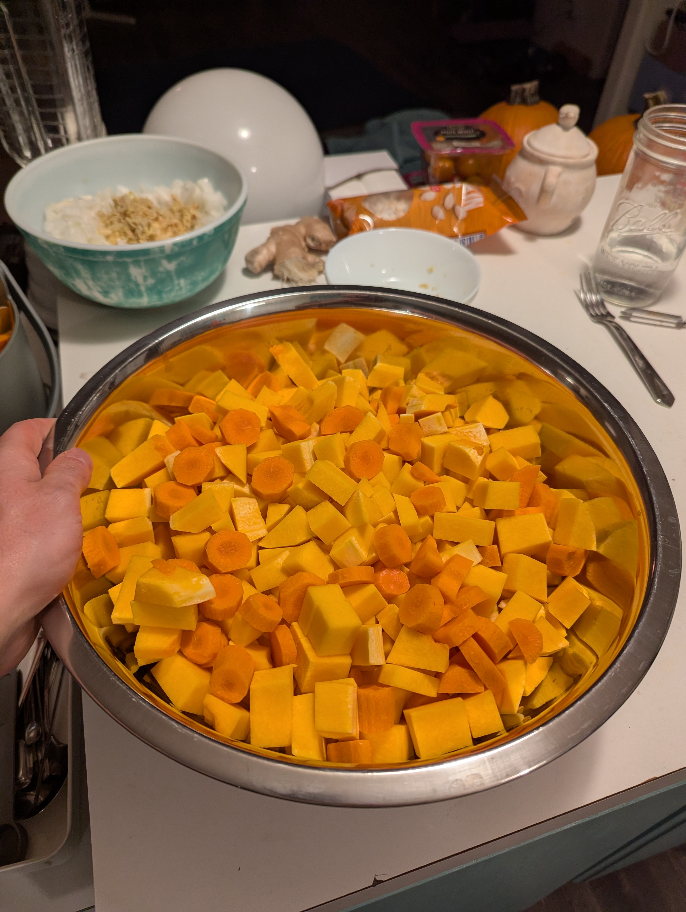

# Butternut Squash Coconut Soup

    

- **Yield:** Big batch recipe! 12-14 hearty servings, about 1 gallon of soup!
- **Storage:** 4 days refrigerated or 3 months frozen  

# Ingrediants

- 2 Tbsp coconut oil or olive oil
- 2 large yellow onions, diced
- 5 cloves garlic, minced
- 2 Tbsp fresh ginger, grated (or 2 tsp ground)
- 2 medium butternut squashes (about 4–5 lbs total), peeled, seeded, and cubed
- 2 medium carrots, chopped
- 6 cups vegetable or chicken broth (can go up to 8 cups for thinner soup)
- 2 (13.5 oz) cans coconut milk (use one full-fat, one light for balanced texture)
- 1½ tsp salt, plus more to taste
- 1 tsp black pepper
- 2 tsp curry powder or 1 Tbsp red curry paste (optional but excellent)
- Juice of 1–2 limes (to brighten at the end)

Optional protein boosters:
- 1 cup cooked red lentils or
- 14 oz silken tofu, blended in before serving

- Toppings: 
    - chopped cilantro
    - toasted pumpkin seed

# Directions
1. **Sauté Aromatics**  
   Heat oil in a large stainless pot (4–5 gal) over medium-high heat.  
   Add onions, garlic, and ginger; cook 5 minutes until fragrant and golden.

2. **Add Vegetables**  
   Stir in squash and carrots. Cook another 5–7 minutes to lightly caramelize.

3. **Simmer**  
   Pour in broth, salt, pepper, and curry powder.  
   Bring to a boil, then reduce heat and simmer 25–30 minutes, until squash is fork-tender.

4. **Blend**  
   Use an immersion blender (or blend in batches) until silky smooth.

5. **Add Coconut Milk**  
   Stir in both cans of coconut milk.  
   If using lentils or tofu, blend them in now for extra creaminess and protein.  
   Simmer gently for 5 minutes — do not boil.

6. **Brighten & Adjust**  
   Stir in lime juice and adjust seasoning to taste.

7. **Serve or Store**  
   Cool before portioning into freezer-safe containers (1–2 cup portions work best).  
   Label with date and freeze flat if using bags.