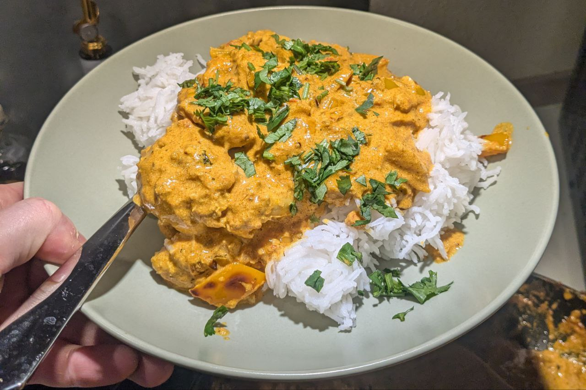
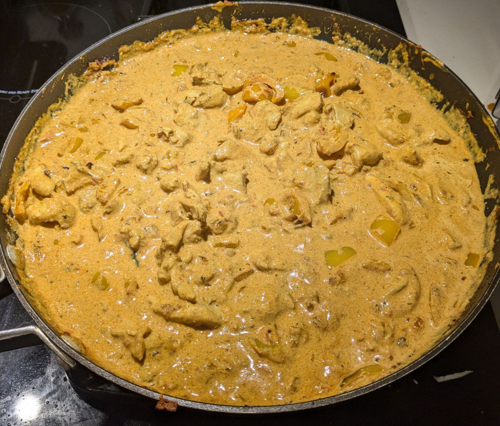

# Kukhurako Shiraz #3

<div style="text-align: center;">
    
    
</div>

## Origin Story
This recipe is inspired by the Kukhurako Shiraz dish from Himshikar (now called [Ravintola Base Camp](https://basecampkaivopiha.fi/)) Nepalese Restauraunt in Helsinki, Finland.

The website `https://www.himshikhar.fi/` is no longer online, but thankfully the Internet Archive's Wayback Machine can help us find the [original menu listing](https://web.archive.org/web/20180325133725/http://www.himshikhar.fi/fi):
```
28. Kukhurako Shiraz
Tandoorimarinoitu kanaa tikka-inkivääri-chili-sipuli-paprika-kermakastikkeessa
Tandoori-marinated chicken tikka in a ginger, chili, onion, paprika, and cream sauce.
```

ChatGPT's tranlsation of the recipe states that __Kukhurako__ is a word from Nepalese, not Finnish. In the Nepali language, "kukhura" (कुखुरा) means chicken, and the suffix "-ko" is possessive, so "kukhurako" translates to "of chicken" or "chicken's". __Shiraz__ is an ancient city in Iran (Persia), known historically for its rich cultural heritage, art, poetry, and cuisine.

I had originaly tried finding similar Chicken Tikka Masala recipes that I thought were similar to Himshikar's Kukhurako Shiraz:
- Attempt #1: [Chef John's Chicken Tikka Masala](https://www.allrecipes.com/recipe/239867/chef-johns-chicken-tikka-masala/): This is a good recipe (rating 8/10) but due to the coconut milk substitute over cream, it isn't very similar to Kukhurako Shiraz.
- Attempt #2: [Instant Pot Chicken Tikka Masala](https://pipingpotcurry.com/instant-pot-chicken-tikka-masala/): This recipe wasn't that great (rating 5/10) likely due to me only marinating for 1 hour instead of 24 hours and likely overcooking the chicken in the pressure cooker. Also the flavors were far from Kukhurako Shiraz profile.
- Attempt #3: This recipe (rating 9/10), not exaclty like the Kukhurako Shiraz, mostly due to the potent (but delicious) mustard oil.

After long discussion with ChatGPT I came up with this __Kukhurako Shiraz__ recipe.


## Ingredients

### Garlic Ginger Paste
- Fresh garlic: 1/2 cup (approximately 10–12 medium cloves)
- Fresh ginger: 1/2 cup (peeled and chopped)
- Neutral oil: 1–2 tbsp (e.g., sunflower or vegetable oil) (Optional, for smoother blending and longer storage)

### Marinade:
- 2 lbs boneless chicken thighs
- 2 cups thick plain yogurt (preferably Greek yogurt)
- 2 tbsp ginger-garlic paste (fresh is best; see tips)
- 2 tsp turmeric powder
- 2 tsp chili powder (adjust for heat tolerance)
- 2 tsp paprika (smoked paprika if available)
- 2 tsp ground cumin
- 2 tsp ground coriander
- 2 tbsp lemon juice
- 2 tsp salt
- 2 tbsp [mustard oil](https://www.amazon.com/Rani-Mustard-NON-GMO-Friendly-Natural/dp/B08W4Q77S6?crid=24X7M6AZU5JOO&dib=eyJ2IjoiMSJ9.SbgYQnPA0ugCezM1l4HtKXL6eqwySPiObnBUeBqgOZFdxMKb9VDZ5bt-5SmkdPpFLSNDoq4io7aQZI_tDHdUuYL_-yGpXT74z5uBdFd5Xs4F7zylAn3FIQKkUpu04A6mUtZauxvuqkHDnxWPNaZB5LD17Spl26vNDTHovlqEiYssriz5_Ya--UduDYeICDsumj0T-TMGtOV4JcHOe9t5bh4NHWVc8HVnHAc71CwlEo0xQQvV45ob5aNx1oBkorapoQhea5_tBdEGNG1xb0bLI4WnXOcsDbIkxJuIMWbSdOw.c1lQd7-mL7D81_xH5gy77-ydDUdYkN7xbw4xxwGwMFY&dib_tag=se&keywords=mustard+oil&qid=1734403775&sprefix=mustard+oi%2Caps%2C225&sr=8-5) (or neutral oil)

### Shiraz Sauce:
- 4 tbsp ghee or neutral oil (you can make ghee from butter at home, watch this video: [How to Make Ghee | Chef Jean-Pierre](https://www.youtube.com/watch?v=sGFtNRKiHS4))
- 2 large onions, finely chopped
- 2 tbsp ginger-garlic paste
- 4 medium ripe tomatoes, pureed (or 1 1/2 cups canned tomato puree)
- 2 red bell peppers, diced
- 2 green chilies, slit lengthwise (optional for heat)
- 2 tsp turmeric powder
- 2 tsp paprika (or [Kashmiri chili powder](https://www.amazon.com/Rani-Kashmiri-Indian-Salt-Free-Ingredients/dp/B07S8LY8NS?crid=1SLZS7FG4DWJL&dib=eyJ2IjoiMSJ9.Bna4Ocn-TM5fbX38DuT4U4NyFhMESUPOOiBsIOWxH92bWHxs6rweKR94HWbgPD6ARimyNT81i-RTpDOmHQr0_iGrFQ4uaE5XLsfdPHVwj6FsvCWlRuHo13gLGGmkH-KGLI1mgnKo5jXrgi72Ev1dtS5ER1FJ5YtyJi3DbwH8-5pW-XRb5ZfJC78Hp21LjSjWqIemydyTfg_uz8PnbfE5tGO0BUDIhgrOFBsIMzrKVi4nBzIkKqyId0988QFBfyjDpfTYZdYTbZ_sbdFHWtP7TNpFPodTOe43Gh8wPjIhaIk.0FJvmF626WegPo8_Ogpkf7gNfIfaoJRcEApMCPPryl4&dib_tag=se&keywords=kashmiri+chili+powder&qid=1734404764&sprefix=kashmir%2Caps%2C3050&sr=8-5))
- 2 tsp ground cumin
- 2 tsp ground coriander
- 1 tsp garam masala (see notes below)
- 1 tsp dried fenugreek leaves (kasoori methi), crushed
- 1 cup heavy cream
- Salt to taste
- Fresh cilantro for garnish

### Notes on ingredients
- Mustard Oil:
    - Pungency and Earthiness Mustard oil has a strong, sharp, and nutty flavor with a slight peppery undertone. This makes it an excellent base for spiced dishes, as it enhances the depth of the spices without overpowering them.
    - Heat and Complexity: When heated to its smoking point (to neutralize bitterness), mustard oil develops a more rounded and mellow flavor that enhances marinades and gravies, adding subtle complexity.
- Kashmiri chili powder
    - My friend [@Minnesota_Toz](https://www.twitch.tv/minnesota_toz) who streams Food & Drink on Twitch said that this is the secret to the vibrant red Chicken Tikka Massala found in the UK.

    - Flavor Profile: Kashmiri chili powder is known for its mild heat and vibrant red color.
    It has a subtly smoky and sweet flavor without overwhelming spiciness, making it a great choice for a dish that balances warmth, creaminess, and richness.

    - Aesthetic Appeal: The striking red color enhances the visual appeal of the Shiraz sauce, giving it that restaurant-quality look without making it overly spicy.

    - Traditional Influence: While not traditionally Nepalese, Kashmiri chili powder is widely used in Indian and fusion dishes like butter chicken and tikka masala, which share similarities with Kukhurako Shiraz. Its use would complement the dish’s spiced and creamy tomato base.

- Garam Masala
    - Garam masala is best added toward the end of cooking the Shiraz sauce, just before you stir in the cream.
    - Garam masala is a blend of delicate spices like cardamom, cloves, and nutmeg, which lose their fragrance if cooked too long.
    - Garam masala acts as a finishing spice, balancing the flavors of the sauce after the base spices (like cumin, coriander, and turmeric) have had time to cook.
    - Cooking it too early can make the sauce taste heavy or muddy, masking the bright and fresh flavors of ginger, garlic, and tomatoes.

I chose Garam Masala over Tandoori Masala and Tikka Masala, here's the comparison:
| **Blend**              | **Key Ingredients**                              | **Flavor Profile**       | **Best Use**                    |
|-------------------------|-------------------------------------------------|--------------------------|---------------------------------|
| [**Tandoori Masala**](https://www.amazon.com/Rani-Tandoori-Masala-Natural-Indian/dp/B077KHB3BH)     | Cumin, Coriander, Cinnamon, Mango Powder, Dry Ginger, Turmeric, Chillies, Garlic, Cloves, Mace, Paprika (11-Spice Blend) | Tangy, earthy, slightly smoky | Marinades for grilling (tandoori-style) |
| [**Tikka Masala**](https://www.amazon.com/Rani-Tikka-Masala-Indian-Colors/dp/B077K9KZNG)        | Paprika, Cumin, Ginger, Turmeric, Coriander, Cinnamon, Kashmiri Chilli (7-spice) | Mild, slightly sweet, vibrant | Creamy curries like tikka masala |
| [**Garam Masala**](https://www.amazon.com/Rani-Garam-Masala-Indian-Spice/dp/B00309S13Q)        | Coriander, Cumin, Cinnamon, Black Pepper, Cloves, Ginger, Mace, Green Cardamom, Black Cardamom, Nutmeg, Bay Leaves (11-spice) | Warm, aromatic, complex | Finishing spice for curries and gravies |


## Directions

Marinade the chicken for 24 hours for best results!

### Garlic Ginger Paste
Skip if using store bought garlic-ginger paste
1. Peel equal parts fresh garlic and ginger.  
2. Cut the ginger into small chunks.  
3. Blend garlic and ginger with 1–2 tbsp neutral oil until smooth (use a food processor or immersion blender for best results).
4. Use immediately or store in an airtight container with a thin oil layer on top.  
   - Refrigerate for up to 1 week or freeze in portions for up to 1 month.

### Marinade the Chicken
1. Combine all marinade ingredients in a large bowl. Mix well.
2. Lightly score the chicken thighs or cut them into large chunks. Coat thoroughly with the marinade.
3. Cover and refrigerate for at least 6 hours or overnight for maximum flavor penetration.

### Grill or Roast the Chicken

1. Preheat your oven or grill to 220°C (425°F). Use a grill pan for stovetop cooking if needed.
3. Place the marinated chicken on a baking tray or skewer for even cooking. Grill or roast for 20–25 minutes until charred and cooked through.
4. Baste with melted butter or ghee midway through cooking for added flavor.
5. Set aside the cooked chicken, reserving any juices for the sauce.

### Prepare the Shiraz Sauce

1. Sauté Aromatics:
    - Heat ghee or oil in a heavy-bottomed pan. Add the onions and sauté until golden brown.
    - Stir in the ginger-garlic paste and cook for 2–3 minutes until fragrant.

3. Bloom the Spices:
    - Add turmeric, paprika, cumin, and coriander powders. Cook for 1–2 minutes to release their flavors.

4. Cook the Tomato Base:
    - Add pureed tomatoes and cook until the oil separates from the mixture (about 10–12 minutes).
    - Toss in diced red bell peppers and slit green chilies. Sauté until softened.

5. Combine Chicken and Sauce:
    - Add the grilled chicken and its juices. Stir to coat the chicken in the sauce.
    - Reduce the heat and simmer for 10 minutes to let the flavors meld.

6. Finish with Cream and Fenugreek:
    - Stir in heavy cream and crushed fenugreek leaves. Simmer gently for 2–3 minutes. Adjust salt to taste.

### Garnish and Serve
1. Garnish with fresh cilantro leaves.
2. Serve hot with naan, roti, or steamed basmati rice.
