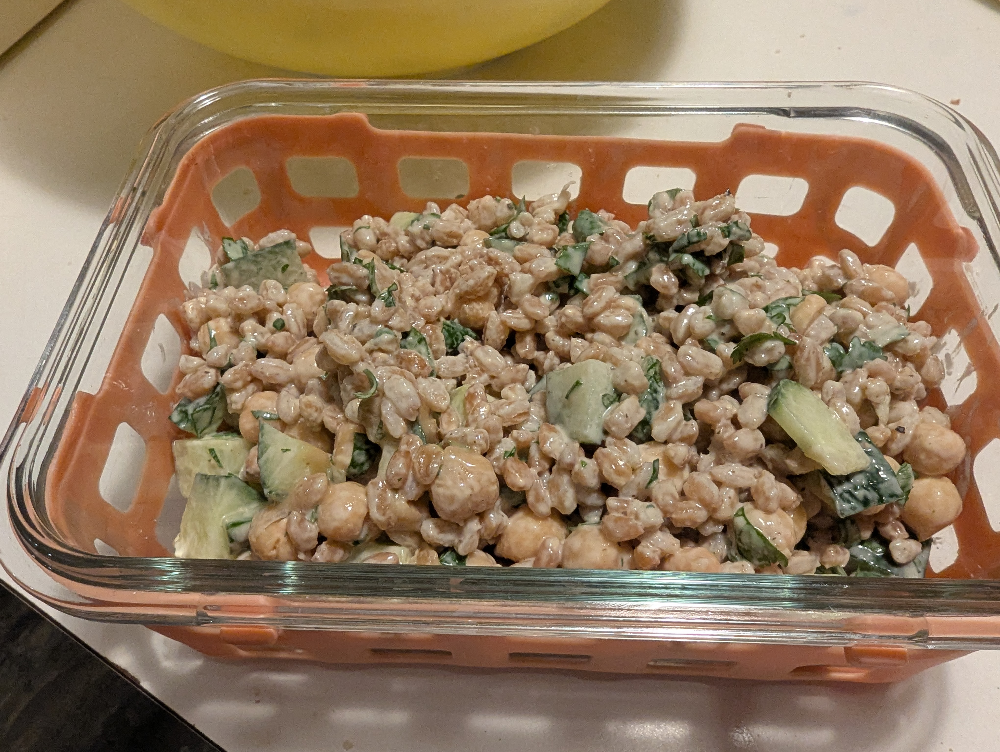

# Farro/Quinoa Chickpea Salad

    

## Ingrediants
- 3 cups of cooekd farro or quinoa
- 2 cups chickpeas (cooked, easiest from a can)
- 1 cup diced cucumber
- 1/2 cup parsley or cilantro
- dressing:
    - 1/4 cup tahini
    - 2 Tbsp lime juice
    - 3 Tbsp water
    - salt and pepper to taste

## Directions
- Thoroughly mix all ingrediants in a bowl
- Put in storage containers and store in fridge
- Keeps up to 4 days